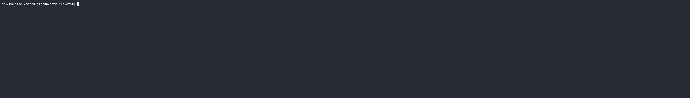

# PathElevator (`ud`)


> A filesystem path traversal tool that visualises every directory level between two ancestor paths — like riding an elevator floor by floor, but through your directory tree.

---

## Concept

When you run `ls` and then `cd` into a folder, you only see the contents of one level at a time. `ud` shows you every floor at once — from a shallower ancestor down to a deeper one (or in reverse), printing the directory listing at each stop along the way.

The elevator metaphor is intentional: floors correspond to directory depth, ASCEND means moving toward the filesystem root, and DESCEND means drilling down toward a target path.

---

## Development History

### Phase 1 — Elevator Simulator (July 2024)

The project began as a console-based **building elevator simulator** (`elevator.cpp`), written as an OOP exercise. It modelled a 10-floor building with two elevators dispatched by a nearest-car algorithm.

Key characteristics of the original:
- Single-file design (`elevator.cpp`) containing `Elevator` and `UI` classes
- `assert()` used for input validation — would abort on invalid input
- Nearest-car dispatch: `min(|currentFloor − riderFloor|)` across both elevators
- No separation between business logic and I/O

### Phase 2 — OOP Refactor (May 2026)

The monolithic file was split into three classes with distinct responsibilities:

| Class | File | Responsibility |
|---|---|---|
| `Elevator` | `src/Elevator.cpp` | Floor state and travel simulation |
| `Dispatcher` | `src/Dispatcher.cpp` | Nearest-car selection policy |
| `UI` | `src/UI.cpp` | Console I/O and input validation |

A `Makefile` was added at this stage (release / debug / clean targets). `assert()` was replaced with proper loop-based validation that recovers from bad input instead of aborting.

### Phase 3 — Pivot to PathElevator (May 2026)

The elevator metaphor was kept, but the domain was repurposed from a building simulator to a **filesystem navigation tool**.

The core insight: running `ls` then `cd` only shows one directory at a time. Viewing the full ancestor chain — every level between two known directories — is a common mental task that no standard tool surfaces directly.

The refactor replaced `Elevator/Dispatcher/UI` with a single `PathElevator` class:

- **`PathElevator(target, root)`** — scans and caches every level between `root` and `target` on construction
- **`ride(mode, stop_at)`** — replays the cached levels in ASCEND or DESCEND order
- **`ud(args)`** — static entry point; resolves directory names from the CWD ancestor chain and calls `ride()`

The compiled binary was renamed `ud` (up/down) to be short and typeable.

**Design decisions made during this pivot:**

- *Cache on construction, display on demand* — directory scanning happens once in the constructor; `ride()` is pure display with no filesystem I/O
- *Names, not paths, as arguments* — `ud github path_elevator` is easier to type than absolute paths; the tool resolves names against the actual CWD ancestor chain at runtime
- *No system install required* — the binary is self-contained and operates relative to CWD, so it can be dropped anywhere and used immediately

### Phase 4 — Tab Completion (May 2026)

Because `ud` accepts directory names as arguments, and those names are always drawn from the CWD ancestor chain, tab completion is predictable and complete.

**Problem encountered:** `complete -F _ud ./ud` does not reliably trigger bash completion for commands invoked with a `./` prefix in all bash versions. Registering a completion spec keyed on `./ud` is syntactically accepted but ignored at completion time.

**Solution:** wrap the binary in a shell function named `ud`, then bind the completion spec to the function name. Bash's completion system handles function names consistently regardless of what the underlying binary's path is.

```bash
ud_use() {
    local bin="$1"
    eval "ud() { \"$bin\" \"\$@\"; }"
    complete -F _ud ud
}
```

`ud-completion.bash` calls `ud_use` automatically when it detects `./ud` in the current directory.

---

## Architecture

```
PathElevator/
├── src/
│   ├── main.cpp            # Argument parsing; delegates to PathElevator::ud()
│   └── PathElevator.cpp    # All logic: level building, cache, display, ud()
├── include/
│   └── PathElevator.h      # Class declaration
├── ud-completion.bash      # Bash tab completion for the ud command
└── Makefile
```

### How PathElevator works

```
Constructor
  ├── fs::canonical(target), fs::canonical(root)
  ├── Verify root is an ancestor of target
  ├── buildLevels()  →  [root, …, target]  (ordered by depth)
  └── buildCache()   →  map<path, vector<CachedEntry>>

ud(args)
  ├── Resolve CWD ancestor chain
  ├── Find start, end (and optional stop) by name
  ├── Determine mode: start shallower than end → DESCEND, else ASCEND
  └── Construct PathElevator(target, root) → ride(mode, stop_at)

ride(mode, stop_at)
  └── Iterate cached levels in order, call displayLevel() at each stop
```

---

## Build

**Requirements:** g++ ≥ 9 (C++17), GNU Make

```bash
make          # release build → ./ud
make debug    # AddressSanitizer + debug symbols
make clean    # remove build artefacts
```

---

## Deployment (no system install)

`ud` uses CWD as its operating base. The recommended workflow is to place the binary directly inside the project you want to navigate:

```bash
# Copy binary and completion script to target project
cp ud                  ~/projects/myapp/
cp ud-completion.bash  ~/projects/myapp/

# Enter the project
cd ~/projects/myapp/

# Load tab completion for this terminal session
source ./ud-completion.bash
```

The completion script detects `./ud` automatically and creates a shell function named `ud` bound to that binary. No `$PATH` changes or `~/.bashrc` edits are required.

> **Note:** `source ./ud-completion.bash` must be run once per terminal session. It affects only the current shell; closing the terminal discards it. This is intentional — the setup stays local to the session and does not persist any system-level state.

---

## Usage

```
ud <start> <end> [<stop>]
```

| Argument | Description |
|---|---|
| `start` | A directory name present in the CWD ancestor chain |
| `end` | Another directory name in the same chain; depth relative to `start` determines direction |
| `stop` | Optional — halt display at this level (must lie between `start` and `end`) |

**Direction is inferred automatically:**

| Relationship | Mode |
|---|---|
| `start` shallower than `end` | DESCEND (root → target) |
| `start` deeper than `end` | ASCEND (target → root) |

### Examples

```bash
# CWD: /home/ryan/projects/myapp/src

ud projects src          # DESCEND: projects → myapp → src
ud src projects          # ASCEND:  src → myapp → projects
ud projects src myapp    # DESCEND, stop at myapp (shows projects, myapp)

# With tab completion loaded:
ud pro<TAB>              # completes to "projects"
ud projects my<TAB>      # completes to "myapp"
```

### Demo



### Sample output

```
============================================================
 Path Elevator  |  DESCEND  (root -> target)
============================================================

[Floor 1/3]  /home/ryan/projects
------------------------------------------------------------
  [DIR ] myapp/
  [DIR ] archive/
  [FILE] notes.txt

[Floor 2/3]  /home/ryan/projects/myapp
------------------------------------------------------------
  [DIR ] src/
  [DIR ] tests/
  [FILE] README.md
  [FILE] Makefile

[Floor 3/3]  /home/ryan/projects/myapp/src
------------------------------------------------------------
  [FILE] main.cpp
  [FILE] app.cpp

============================================================
 Arrived at: /home/ryan/projects/myapp/src
============================================================
```

---

## License

MIT — see [LICENSE](LICENSE).
